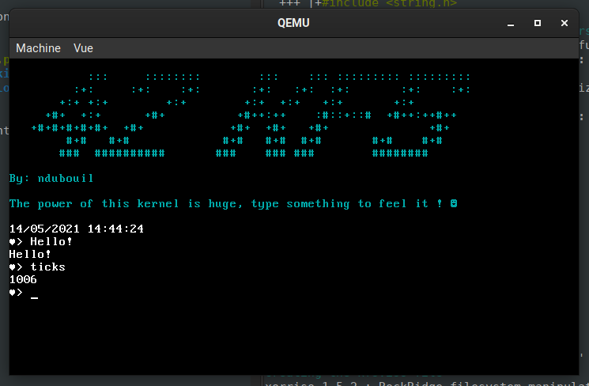
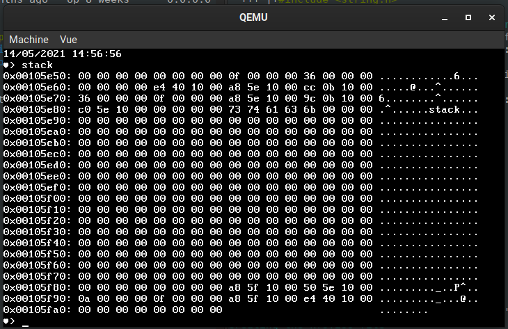

# KFS

Current 42 project : **KFS-4**


>  Discover the world of "Kernel Programming" and learn how to create your very own Kernel from scratch.

32bit very simple kernel

Functionalities:

- Boot (yes!)
- VGA printing
- GDT + stack dump function
- IDT - ISR + IRQ
- Keyboard management
- PIT
- RTC time
- Memory paging
- A heap + kernel virtual memory allocator



## KFS-1

### TODO

- A kernel you can boot via GRUB
- An ASM bootable base
- A basic kernel library, with basics functions and types
- Some basic code to print some stuff on the screen
- A basic "Hello world" kernel

**Bonus**

- [x] Add scroll and cursor support to your I/O interface.
- [x] Add colors support to your I/O interface.
- [x] Add helpers like printf / printk in order to print information / debug easily.
- [x] Handle keyboard entries and print them.
- [ ] Handle different screens, and keyboard shortcuts to switch easily between then.

## KFS-2

### TODO

- Create a Global Descriptor Table
- The GDT must contain:
    - Kernel Code
    - Kernel Data
    - Kernel stack
    - User code
    - User data
    - User stack
- Declare the GDT to the BIOS
- The GDT must be set at address 0x00000800
- Code a tool to print the kernel stack, in a human-friendly way


**Bonus**

- [x] Code a minimalistic shell with a few commands, for debugging pur-poses.
- For example :
    - [x] the print-kernel-stack-thing
    - [x] reboot
    - [x] halt
    - [x] more



## KFS-3

### TODO

- Enable memory paging in your Kernel
- Code a memory structure that handle paging and memory rights
- Define Kernel and User space
- Implement a function to create/get memory pages
- Implement functions to allocate,free and get size of a variable
- Implement those functions for virtual and physical memory
- Handle "kernel panics" (Print, stop the kernel)

## KFS-4

### TODO

- Create an Interrupts Descriptor Table
- A signal-callback system on your Kernel API
- An interface to schedule signals
- An interface to clean registers before a panic / halt
- An interface to save the stack before a panic
- Implement a IDT keyboard handling system


**Bonus**

- [] Coding the base functions for the futures syscalls
- Add some features to the keyboard handler, for example :
    - [x] multi layouts (qwerty, azerty)
    - [x] base functions like get_line

## Compile

```
./generate_sources.sh
make
```

## QEMU run

```
make run
```

## Resources

The Bible: https://wiki.osdev.org/Main_Page

James Molloy: http://www.jamesmolloy.co.uk/tutorial_html

With the osdev complement: https://wiki.osdev.org/James_Molloy's_Tutorial_Known_Bugs

Brandon Friesen - osdever: http://www.osdever.net/bkerndev/Docs/intro.htm

introduction : https://www.linuxjournal.com/content/what-does-it-take-make-kernel-0

bad : https://www.codeproject.com/Articles/1225196/Create-Your-Own-Kernel-In-C-2

https://www.intel.com/content/www/us/en/architecture-and-technology/64-ia-32-architectures-software-developer-vol-3a-part-1-manual.html
