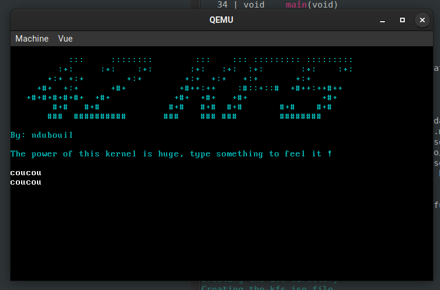

# KFS - 1

>  Discover the world of "Kernel Programming" and learn how to create your very own Kernel from scratch.

32bit very simple kernel, just boot, print and catch keyboard input



# TODO

- A kernel you can boot via GRUB
- An ASM bootable base
- A basic kernel library, with basics functions and types
- Some basic code to print some stuff on the screen
- A basic "Hello world" kernel

**Bonus ideas**

- Add scroll and cursor support to your I/O interface.
- Add colors support to your I/O interface.
- Add helpers like printf / printk in order to print information / debug easily.
- Handle keyboard entries and print them.
- Handle different screens, and keyboard shortcuts to switch easily between then.

**Done**

- [x] Scroll
- [x] Colors
- [x] printf / printk
- [x] keyboard


# Compile

```
./generate_sources.sh
make
```

# QEMU run

```
make run
```
